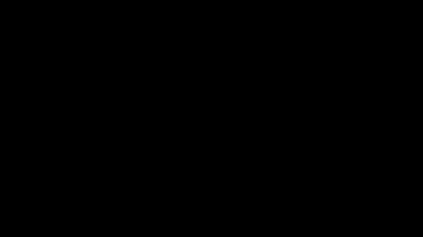
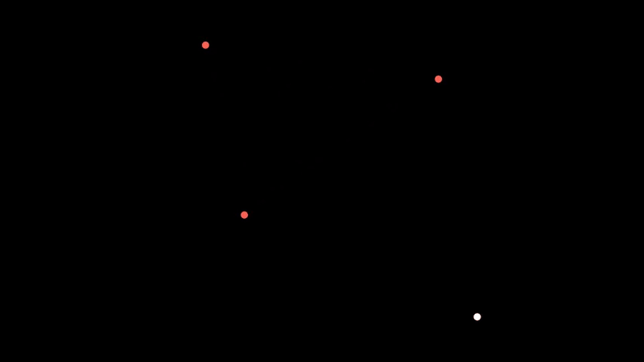

# 🌀 Chaos Theory using Manim

Implementing chaos theory animations using the Manim library in Python

## 1. Levy C Curve

The Levy C Curve can be generated in many ways, the simplest way is to
use transformation matrices

## 2. Sierpinksi Triangle 🔺

The Sierpinski Triangle is a fractal generated by any 3 random points in a plane and dice probabilities, after many iterations it converges to the fractal always

