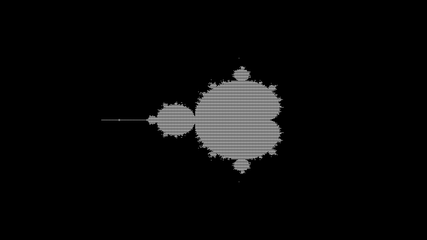
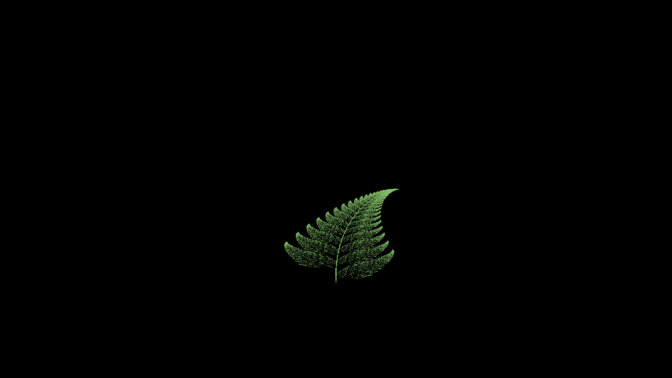

# 🌀 Chaos Theory using Manim

Implementing chaos theory animations using the Manim library in Python. Inspired by this <a href="https://youtu.be/kbKtFN71Lfs?si=H52hHP_0O9CBdGqN">Numberphile</a> video.

## 1. Levy C Curve

The Levy C Curve can be generated in many ways, the simplest way is to
use transformation matrices

## 2. Sierpinksi Triangle 🔺

The Sierpinski Triangle is a fractal generated by any 3 random points in a plane and dice probabilities, after many iterations it converges to the fractal always

## 3. Mandelbrot Set

The mandelbrot set is a set consiting of complex numbers c, which bound the sequence Zn+1 = Zn^2 + c

## 4. Barnsley Fern

Barnsley Fern is generated by affine transformations of specific probabilities.

